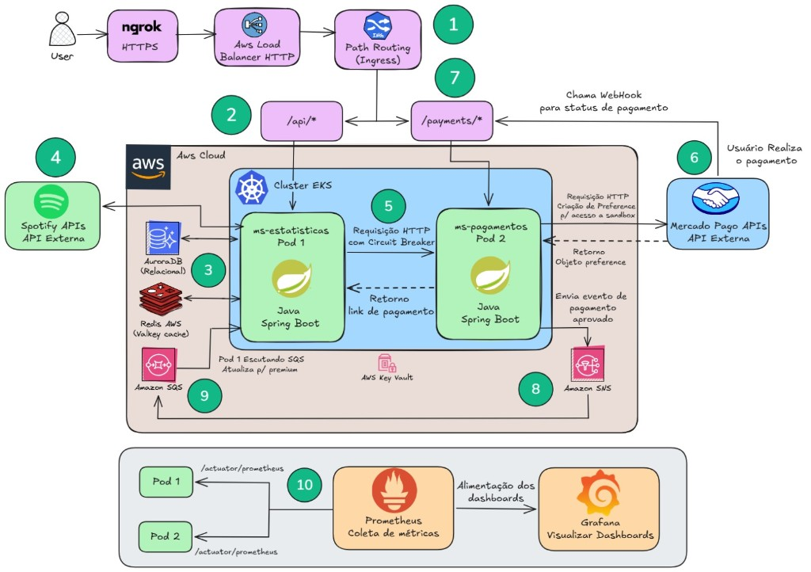
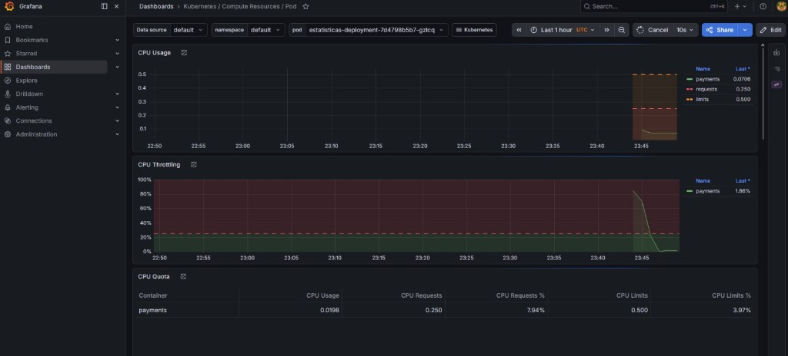

# Spotify Analytics

Microsserviço de **estatísticas de contas Spotify** com planos **Free** e **Premium**, autenticação OAuth2 do Spotify, integração com **Mercado Pago** para upgrade de plano e arquitetura preparada para execução em **Kubernetes (EKS)** na **AWS**, com roteamento via **Ingress**, balanceamento de carga e observabilidade com **Prometheus** e **Grafana**.

## Microsserviços do projeto

A solução completa é composta por **dois microsserviços** em Spring Boot veja a relação abaixo.

| # | Serviço | Repositório |
|---|---------|-------------|
| **1** | **ms-estatisticas** (API de autenticação Spotify, estatísticas Free/Premium, consumo SQS, orquestração de pagamento) | **Este repositório** |
| **2** | **ms-pagamentos** (integração Mercado Pago, preferências de checkout, publicação de eventos) | [**spotify-payments** no GitHub](https://github.com/ruaanls/spotify-payments) |

---

## Visão geral

O sistema agrega dados de consumo do usuário a partir das **APIs públicas do Spotify** (faixas e artistas mais ouvidos, histórico recente, etc.), persiste estatísticas diferenciadas por plano e expõe APIs REST protegidas por **JWT**. O fluxo comercial de **Premium** delega a criação de pagamentos a um **segundo microsserviço** (pagamentos), com **resiliência** na comunicação HTTP; a confirmação de pagamento pode ser propagada por **mensageria** (padrão **SNS → SQS**), atualizando o perfil do usuário de forma assíncrona.

---

## Principais funcionalidades

| Área | Descrição |
|------|-----------|
| **Autenticação** | Fluxo Spotify (redirect/callback), armazenamento de tokens em **Redis** e emissão de **JWT** para o cliente. |
| **Plano Free** | Cálculo e exposição de estatísticas básicas; persistência das agregações. |
| **Plano Premium** | Estatísticas ampliadas, endpoints com controle de papel (`PREMIUM`, `ADMIN`). |
| **Pagamentos** | Geração de link/checkout via microsserviço de pagamentos (**HTTP** + **Circuit Breaker**, **Retry** e **Time Limiter**). |
| **Eventos** | Consumo de fila **SQS** com payload no formato **envelope SNS**, promovendo usuário a Premium após confirmação. |
| **Configuração** | Suporte a parâmetros externos via **AWS Systems Manager Parameter Store** (import opcional no Spring). |
| **Operação** | **Spring Boot Actuator** com health checks (incl. probes) e métricas **Prometheus**. |

---

## Arquitetura

### Estilo: hexagonal (ports & adapters)

O código organiza regras de negócio e orquestração de forma independente de frameworks e de detalhes de infraestrutura:

- **`domain`** — entidades, value objects, papéis (`Role`) e **portas** (interfaces de repositório).
- **`application`** — casos de uso, DTOs, serviços de aplicação, exceções de domínio aplicacional e mapeamentos.
- **`infra`** — **adaptadores**: REST controllers, JPA, Redis, segurança (filtro JWT), `WebClient`, listeners SQS e configurações Spring.

Isso facilita testes, substituição de banco/fila e evolução dos contratos entre microsserviços.

### Diagrama da solução (AWS / EKS)

Fluxo completo: usuário (ex.: **ngrok** HTTPS) → **Load Balancer AWS** → **Ingress** com *path routing* (`/api/*` → **ms-estatisticas**, `/payments/*` → **ms-pagamentos**), integrações **Spotify** e **Mercado Pago**, **SNS/SQS**, **AuroraDB**, **Redis (Valkey)**, **Prometheus/Grafana** e gestão de segredos na AWS.



- **EKS**: orquestração dos dois microsserviços e dos componentes de observabilidade.
- **Ingress + LB**: exposição única, **path routing** para rotear tráfego por prefixo de URL para o serviço correto.
- **Comunicação síncrona**: HTTP (`WebClient`) do serviço de estatísticas para o de pagamentos, com **Resilience4j**.
- **Comunicação assíncrona**: mensagens **SNS** entregues à fila **SQS** consumida por este serviço (`@SqsListener`), alinhado ao padrão de notificação da AWS.

---

## Vídeo demonstração

Você pode visualizar o vídeo demonstração desta solução completa no link abaixo:

**[Assistir no YouTube](https://www.youtube.com/watch?v=sX6PGb-koeA)**

---

## Stack tecnológica

| Camada | Tecnologia |
|--------|------------|
| Runtime | **Java 17**, **Spring Boot 3.2** |
| API | **Spring Web MVC**, **Spring WebFlux** (`WebClient` para Spotify, Mercado Pago via MS2) |
| Segurança | **Spring Security**, JWT (**Auth0 java-jwt**), método seguro com `@PreAuthorize` |
| Dados | **Spring Data JPA**, **Hibernate**, **MySQL** |
| Cache / sessão de token | **Spring Data Redis** (cluster, SSL/TLS com Lettuce) |
| Nuvem AWS | **Spring Cloud AWS 3.3** (SQS, Parameter Store) |
| Resiliência | **Resilience4j** (circuit breaker, retry, time limiter) + integração **Micrometer** |
| Spotify | **spotify-web-api-java** |
| Documentação API | **Springdoc OpenAPI** (UI Swagger) |
| Build | **Gradle** |

---

## API REST (resumo)

Prefixo base comum nos controllers: **`/api`**.

| Método | Caminho | Descrição |
|--------|---------|-----------|
| `GET` | `/api/auth/redirect` | Redireciona para autorização Spotify. |
| `GET` | `/api/auth/callback` | Callback OAuth (código de autorização). |
| `GET` | `/api/auth/token` | Emite JWT após fluxo Spotify (`username`). |
| `GET` | `/api/analytics/free` | Estatísticas **Free** (autenticado). |
| `GET` | `/api/analytics/premium` | Estatísticas **Premium** (papéis `PREMIUM` ou `ADMIN`). |
| `GET` | `/api/premium` | Obtém link/dados de pagamento Mercado Pago (via MS pagamentos). |
| `GET` / `DELETE` | `/api/user` | Consulta ou remove usuário autenticado. |

Rotas **`/auth/**`** e **`/actuator/**`** são públicas na configuração de segurança; demais endpoints exigem JWT válido, salvo regras específicas de papel.

---

## Configuração

Principais propriedades em `src/main/resources/application.yaml`:

| Propriedade | Função |
|-------------|--------|
| `spring.config.import` | `optional:aws-parameterstore:...` — parâmetros centralizados na AWS. |
| `spring.data.redis.*` | Cluster Redis, SSL, timeouts. |
| `spring.datasource.*` | **MySQL** (HikariCP). |
| `ms2.url` | URL base do **microsserviço de pagamentos** (ex.: serviço interno no cluster). |
| `app.aws.sqs.queue-name` | Nome da fila SQS (ex.: `PaymentQueue`). |
| `resilience4j.*` | Instância `ms2-service` (circuit breaker, time limiter). |
| `management.endpoints.web.exposure.include` | `health`, `prometheus` para probes e scraping. |

Variáveis sensíveis (client id/secret Spotify, segredo JWT, URLs, host Redis/RDS) devem ser injetadas via **Parameter Store**, **Secrets Manager** ou secrets do Kubernetes, conforme o ambiente.

---

## Execução local (desenvolvimento)

Requisitos: **JDK 17**, **Gradle** (wrapper incluído), **MySQL** e **Redis** acessíveis conforme o `application.yaml` (ou perfil local com overrides).

```bash
./gradlew bootRun
```

Testes:

```bash
./gradlew test
```

Documentação interativa (com a aplicação no ar): em geral **`/swagger-ui.html`** (Springdoc 2.x).

---

## Observabilidade

- **Micrometer + Prometheus registry**: métricas HTTP e de JVM; compatível com dashboards no **Grafana**.
- **Actuator**: health com **liveness/readiness** (`management.endpoint.health.probes.enabled: true`) para orquestradores como o **Kubernetes**.
- **Resilience4j + Micrometer**: visibilidade de estado de circuitos e chamadas ao microsserviço de pagamentos.

Em produção no **EKS**, o padrão usual é **ServiceMonitor** ou anotações de scrape + **Grafana** com datasources Prometheus apontando para o endpoint de métricas do cluster.

### Grafana em execução (evidência)

Captura do dashboard **Kubernetes / Compute Resources / Pod** no Grafana, com métricas do pod do microsserviço de estatísticas (CPU, *requests*/*limits*, throttling), confirmando o *scrape* do **Prometheus** e a visualização no Grafana.



---


---


## Autoria

Este projeto foi realizado por **Ruan Lima Silva** — [Linkedln](https://www.linkedin.com/in/ruanls/)

